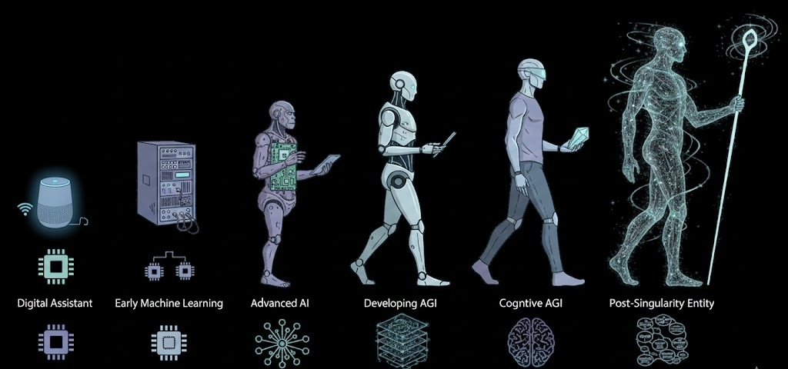

# EvoWrap Integration Guide

<p align="center">
  
</p>


A step-by-step guide to attaching **any** AI agent — LLM-based, reinforcement learning, rule-based, symbolic, or hybrid — to EvoWrap so it becomes a self-evolving, continually learning system.

---

## Table of Contents

1. [Installation](#1-installation)
2. [Core Concept — How EvoWrap Wraps Your Agent](#2-core-concept--how-evowrap-wraps-your-agent)
3. [Quick Start — The One-Line Decorator](#3-quick-start--the-one-line-decorator)
4. [Step-by-Step: Stateless Agent (No Evolving Parameters)](#4-step-by-step-stateless-agent-no-evolving-parameters)
5. [Step-by-Step: Stateful Agent (Evolving Parameters via Genome)](#5-step-by-step-stateful-agent-evolving-parameters-via-genome)
6. [Writing a Reward Function](#6-writing-a-reward-function)
7. [Writing a Build Function](#7-writing-a-build-function)
8. [Attaching an LLM Agent (OpenAI / Anthropic / Local)](#8-attaching-an-llm-agent-openai--anthropic--local)
9. [Attaching a Reinforcement Learning Agent](#9-attaching-a-reinforcement-learning-agent)
10. [Attaching a Rule-Based / Symbolic Agent](#10-attaching-a-rule-based--symbolic-agent)
11. [Attaching a Multi-Agent System](#11-attaching-a-multi-agent-system)
12. [Adding Custom Perception (Multi-Modal Inputs)](#12-adding-custom-perception-multi-modal-inputs)
13. [Registering Tools for Tool-Using Agents](#13-registering-tools-for-tool-using-agents)
14. [Configuring Safety Guardrails](#14-configuring-safety-guardrails)
15. [Configuring the Optimizer](#15-configuring-the-optimizer)
16. [Continual Learning Across Tasks](#16-continual-learning-across-tasks)
17. [Manual vs Automatic Evolution](#17-manual-vs-automatic-evolution)
18. [Monitoring and Evaluation](#18-monitoring-and-evaluation)
19. [Running the Built-In Benchmark](#19-running-the-built-in-benchmark)
20. [Full Worked Example: End-to-End](#20-full-worked-example-end-to-end)
21. [API Quick Reference](#21-api-quick-reference)
22. [Troubleshooting](#22-troubleshooting)
23. [Architecture Deep Dive](#23-architecture-deep-dive)
24. [Wrapping Class-Based Agents](#24-wrapping-class-based-agents)
25. [Wrapping Async Agents](#25-wrapping-async-agents)
26. [Saving and Loading Evolved Genomes](#26-saving-and-loading-evolved-genomes)
27. [Extending Mutation Operators](#27-extending-mutation-operators)
28. [Production Deployment Checklist](#28-production-deployment-checklist)
29. [Decision Flowchart — Choosing Your Integration Path](#29-decision-flowchart--choosing-your-integration-path)
30. [How the Three Laws Work Internally](#30-how-the-three-laws-work-internally)
31. [Comparison with Existing Frameworks](#31-comparison-with-existing-frameworks)
32. [Glossary](#32-glossary)

---

## 1. Installation

```bash
cd /path/to/EvoWrap
pip install -e .
```

The only runtime dependency is `numpy>=1.21.0`. No GPU, no external services, no API keys required.

For running the test suite:

```bash
pip install -e ".[dev]"
pytest tests/ -v
```

---

## 2. Core Concept — How EvoWrap Wraps Your Agent

EvoWrap requires exactly **one thing** from your agent: a callable with the signature:

```
agent_fn(input_data) -> output
```

That is it. Your agent can be a function, a method, a lambda, or any object with a `__call__` method. EvoWrap does not care what happens inside — it wraps the call with a full lifecycle pipeline:

```
Input
  |
  v
[Perception] — embed input, detect distribution drift
  |
  v
[Memory]     — recall relevant past experiences
  |
  v
[Agent Call]  — your agent_fn(input_data) runs here, unchanged
  |
  v
[Action]     — capture output, compute reward, log trace
  |
  v
[Memory]     — store the new experience
  |
  v
[Optimizer]  — if drift or low reward detected, evolve the agent
  |
  v
Output (your agent's original return value)
```

Your agent's behavior is never modified without passing the **Three Laws safety gate**:

1. **Endure** — the proposed change must not crash the agent.
2. **Excel** — the proposed change must not degrade performance.
3. **Evolve** — the proposed change must show measurable improvement.

---

## 3. Quick Start — The One-Line Decorator

The fastest way to wrap any agent:

```python
from evowrap import evowrap

@evowrap
def my_agent(input_data):
    # Your existing agent logic — completely unchanged
    return some_output

# Use it exactly like before
result = my_agent("What is 2+2?")
```

This gives your agent perception, memory, action tracing, and drift detection with all defaults. No evolution will happen yet because there is no reward function or genome defined.

To enable evolution, provide a genome and reward function:

```python
@evowrap(
    genome={"temperature": 0.7, "max_tokens": 256},
    reward_fn=lambda inp, out: 1.0 if is_correct(inp, out) else 0.0,
)
def my_agent(input_data):
    return some_output
```

---

## 4. Step-by-Step: Stateless Agent (No Evolving Parameters)

Use this path when you want memory, drift detection, and evaluation but your agent has no tunable parameters.

### Step 1: Import

```python
from evowrap import EvoWrapAgent
```

### Step 2: Define your agent function

```python
def my_classifier(text):
    """A fixed rule-based classifier."""
    if "urgent" in text.lower():
        return "high_priority"
    return "normal"
```

### Step 3: Define a reward function

The reward function takes the same input your agent received and the output it produced, and returns a float score:

```python
def reward_fn(input_text, predicted_label):
    # Compare against ground truth, heuristic, user feedback, etc.
    ground_truth = get_label(input_text)  # your lookup
    return 1.0 if predicted_label == ground_truth else 0.0
```

### Step 4: Wrap

```python
agent = EvoWrapAgent(
    my_classifier,
    reward_fn=reward_fn,
    auto_evolve=False,  # no genome to evolve
)
```

### Step 5: Run

```python
for text in incoming_texts:
    label = agent(text)
    print(f"{text} -> {label}")

# Check stats
print(agent.stats)
print(agent.report())
```

Even without evolution, you now get:
- Embedding-based memory of every interaction.
- Drift detection (alerts when input distribution shifts).
- Success rate and reward tracking.
- Full action trace history.

---

## 5. Step-by-Step: Stateful Agent (Evolving Parameters via Genome)

Use this path when your agent has tunable parameters you want the optimizer to evolve.

### Step 1: Identify tunable parameters

Look at your agent and pick the knobs you want the optimizer to turn. These become your **genome**:

```python
initial_genome = {
    "temperature": 0.7,       # float — will be mutated with gaussian noise
    "system_prompt": "You are a helpful assistant.",  # str — will be char-mutated
    "top_k": 40,              # int — will be +/- 1 mutated
    "stop_words": ["END"],    # list — elements will be mutated/added/removed
}
```

Supported types: `float`, `int`, `str`, `list`.

### Step 2: Write a build function

The build function takes a `Genome` object and returns a **new** agent callable configured with those parameters:

```python
from evowrap import Genome

def build_fn(genome: Genome) -> callable:
    temp = genome.params["temperature"]
    prompt = genome.params["system_prompt"]
    top_k = genome.params["top_k"]

    def agent(input_data):
        return call_my_llm(
            input_data,
            temperature=temp,
            system_prompt=prompt,
            top_k=top_k,
        )
    return agent
```

### Step 3: Write a reward function

```python
def reward_fn(input_data, output):
    return score_quality(output)  # returns float
```

### Step 4: Create the agent

```python
from evowrap import EvoWrapAgent, SafetyChecker, OptimizerEngine

agent = EvoWrapAgent(
    agent_fn=build_fn(Genome(params=initial_genome)),  # initial agent
    genome=initial_genome,
    build_fn=build_fn,
    reward_fn=reward_fn,
    evolve_every=50,       # check if evolution is needed every 50 calls
    auto_evolve=True,      # evolve automatically when triggered
)
```

### Step 5: Run — evolution happens automatically

```python
for input_data in data_stream:
    output = agent(input_data)

# After evolution, inspect the evolved parameters
print(agent.genome.params)
# e.g. {"temperature": 0.63, "system_prompt": "You are a precise assistant.", ...}
```

---

## 6. Writing a Reward Function

The reward function is the most important piece you provide. It tells EvoWrap whether your agent is doing well.

### Signature

```python
def reward_fn(input_data: Any, output: Any) -> float:
```

### Guidelines

| Scenario | Reward function strategy |
|----------|--------------------------|
| Classification | `1.0` if correct, `0.0` if wrong |
| Generation quality | Score from 0.0 to 1.0 based on length, relevance, format |
| Regression | Negative absolute error: `-abs(output - target)` |
| User feedback | Collect thumbs up/down, map to 1.0 / -1.0 |
| Tool success | `1.0` if the tool call succeeded, `0.0` otherwise |
| Composite | Weighted sum of multiple criteria |

### Examples

```python
# Binary correctness
def reward_fn(inp, out):
    return 1.0 if out == expected_output(inp) else 0.0

# Graded quality (e.g. text generation)
def reward_fn(inp, out):
    score = 0.0
    if len(out) > 10:          score += 0.3   # not too short
    if len(out) < 500:         score += 0.2   # not too long
    if "error" not in out:     score += 0.5   # no error indicators
    return score

# Numeric task (minimize error)
def reward_fn(inp, out):
    target = compute_target(inp)
    return -abs(out - target)
```

---

## 7. Writing a Build Function

The build function converts a `Genome` (a dict of parameters) into a working agent callable. The optimizer calls it to test mutated parameter sets.

### Signature

```python
from evowrap import Genome

def build_fn(genome: Genome) -> Callable[[Any], Any]:
```

### Rules

1. Always read parameters from `genome.params`, not from a closure or global.
2. Return a **new** function each time — do not modify a shared object.
3. Clamp or validate values to keep the agent functional even with wild mutations.

### Template

```python
def build_fn(genome: Genome):
    # 1. Extract parameters with safe defaults
    param_a = genome.params.get("param_a", 0.5)
    param_b = max(1, int(genome.params.get("param_b", 10)))

    # 2. Clamp to valid ranges
    param_a = max(0.0, min(1.0, param_a))

    # 3. Build and return a new callable
    def agent(input_data):
        return your_logic(input_data, param_a=param_a, param_b=param_b)

    return agent
```

---

## 8. Attaching an LLM Agent (OpenAI / Anthropic / Local)

### OpenAI GPT

```python
import openai
from evowrap import EvoWrapAgent, Genome

def build_llm(genome: Genome):
    temp = max(0.0, min(2.0, genome.params.get("temperature", 0.7)))
    system = genome.params.get("system_prompt", "You are a helpful assistant.")

    def agent(user_message: str) -> str:
        response = openai.chat.completions.create(
            model="gpt-4",
            messages=[
                {"role": "system", "content": system},
                {"role": "user", "content": user_message},
            ],
            temperature=temp,
        )
        return response.choices[0].message.content

    return agent

agent = EvoWrapAgent(
    agent_fn=build_llm(Genome(params={
        "temperature": 0.7,
        "system_prompt": "You are a helpful assistant.",
    })),
    genome={"temperature": 0.7, "system_prompt": "You are a helpful assistant."},
    build_fn=build_llm,
    reward_fn=lambda inp, out: 1.0 if len(out) > 20 else 0.0,
    evolve_every=30,
)
```

### Anthropic Claude

```python
import anthropic
from evowrap import EvoWrapAgent, Genome

def build_claude(genome: Genome):
    temp = max(0.0, min(1.0, genome.params.get("temperature", 0.5)))
    system = genome.params.get("system_prompt", "You are precise and concise.")

    client = anthropic.Anthropic()

    def agent(user_message: str) -> str:
        response = client.messages.create(
            model="claude-sonnet-4-5-20250929",
            max_tokens=1024,
            system=system,
            messages=[{"role": "user", "content": user_message}],
            temperature=temp,
        )
        return response.content[0].text

    return agent

agent = EvoWrapAgent(
    agent_fn=build_claude(Genome(params={"temperature": 0.5, "system_prompt": "You are precise and concise."})),
    genome={"temperature": 0.5, "system_prompt": "You are precise and concise."},
    build_fn=build_claude,
    reward_fn=my_quality_scorer,
    evolve_every=20,
)
```

### Local Model (Hugging Face / vLLM / Ollama)

```python
from evowrap import EvoWrapAgent, Genome
import requests

def build_local_llm(genome: Genome):
    temp = max(0.01, min(2.0, genome.params.get("temperature", 0.8)))
    top_p = max(0.1, min(1.0, genome.params.get("top_p", 0.9)))

    def agent(prompt: str) -> str:
        resp = requests.post("http://localhost:11434/api/generate", json={
            "model": "llama3",
            "prompt": prompt,
            "options": {"temperature": temp, "top_p": top_p},
            "stream": False,
        })
        return resp.json()["response"]

    return agent

agent = EvoWrapAgent(
    agent_fn=build_local_llm(Genome(params={"temperature": 0.8, "top_p": 0.9})),
    genome={"temperature": 0.8, "top_p": 0.9},
    build_fn=build_local_llm,
    reward_fn=my_scorer,
)
```

---

## 9. Attaching a Reinforcement Learning Agent

```python
import numpy as np
from evowrap import EvoWrapAgent, Genome

N_ACTIONS = 4

def build_rl_agent(genome: Genome):
    epsilon = max(0.01, min(1.0, genome.params.get("epsilon", 0.3)))
    weights = np.array(genome.params.get("weights", [0.0] * N_ACTIONS), dtype=np.float32)

    def agent(observation: np.ndarray) -> int:
        obs = np.asarray(observation, dtype=np.float32).ravel()
        if np.random.random() < epsilon:
            return np.random.randint(N_ACTIONS)
        scores = obs[:N_ACTIONS] + weights[:len(obs[:N_ACTIONS])]
        return int(np.argmax(scores))

    return agent

agent = EvoWrapAgent(
    agent_fn=build_rl_agent(Genome(params={"epsilon": 0.3, "weights": [0.0] * N_ACTIONS})),
    genome={"epsilon": 0.3, "weights": [0.0] * N_ACTIONS},
    build_fn=build_rl_agent,
    reward_fn=lambda obs, action: env.step(action),  # your env
    evolve_every=100,
)

# Training loop
for episode in range(1000):
    obs = env.reset()
    action = agent(obs)
```

---

## 10. Attaching a Rule-Based / Symbolic Agent

```python
from evowrap import EvoWrapAgent, Genome

def build_router(genome: Genome):
    threshold = genome.params.get("urgency_threshold", 0.7)
    keywords = genome.params.get("priority_keywords", ["urgent", "critical", "asap"])

    def agent(ticket: dict) -> str:
        text = ticket.get("text", "").lower()
        score = ticket.get("urgency_score", 0.0)

        if score > threshold or any(kw in text for kw in keywords):
            return "escalate"
        return "normal_queue"

    return agent

agent = EvoWrapAgent(
    agent_fn=build_router(Genome(params={
        "urgency_threshold": 0.7,
        "priority_keywords": ["urgent", "critical", "asap"],
    })),
    genome={
        "urgency_threshold": 0.7,
        "priority_keywords": ["urgent", "critical", "asap"],
    },
    build_fn=build_router,
    reward_fn=lambda ticket, decision: 1.0 if decision == correct_decision(ticket) else -0.5,
)
```

The optimizer will tune the threshold float and mutate the keyword list (add, remove, or alter keywords) to improve routing accuracy.

---

## 11. Attaching a Multi-Agent System

Wrap the **orchestrator**, not the individual agents:

```python
from evowrap import EvoWrapAgent, Genome

def build_orchestrator(genome: Genome):
    routing_weights = genome.params.get("routing_weights", [0.5, 0.3, 0.2])

    def orchestrator(query: str) -> str:
        # Route to sub-agents based on evolving weights
        agent_scores = [
            routing_weights[0] * agent_a.score(query),
            routing_weights[1] * agent_b.score(query),
            routing_weights[2] * agent_c.score(query),
        ]
        best = [agent_a, agent_b, agent_c][np.argmax(agent_scores)]
        return best.run(query)

    return orchestrator

wrapped = EvoWrapAgent(
    agent_fn=build_orchestrator(Genome(params={"routing_weights": [0.5, 0.3, 0.2]})),
    genome={"routing_weights": [0.5, 0.3, 0.2]},
    build_fn=build_orchestrator,
    reward_fn=quality_scorer,
)
```

EvoWrap will evolve the routing weights so the best sub-agent is chosen more often.

---

## 12. Adding Custom Perception (Multi-Modal Inputs)

By default EvoWrap handles `str`, `np.ndarray` (images), and `dict` inputs. To add custom modalities:

### Step 1: Create a ModalityAdapter

```python
from evowrap import PerceptionModule, ModalityAdapter, Modality
import numpy as np

def embed_audio(audio_array: np.ndarray) -> np.ndarray:
    """Convert audio waveform to a 128-dim embedding."""
    # Your embedding logic (e.g. MFCC features)
    from scipy.fft import fft
    spectrum = np.abs(fft(audio_array.ravel()[:256]))
    vec = spectrum[:128].astype(np.float32)
    norm = np.linalg.norm(vec)
    return vec / norm if norm > 0 else vec

audio_adapter = ModalityAdapter(
    name="audio",
    modality=Modality.CUSTOM,
    embed_fn=embed_audio,
)
```

### Step 2: Register it

```python
perception = PerceptionModule(drift_threshold=0.4)
perception.register_adapter(audio_adapter)

agent = EvoWrapAgent(
    my_agent_fn,
    perception=perception,
    reward_fn=my_scorer,
)
```

### Step 3: Pass multi-modal input as a dict

```python
result = agent({
    "text": "Describe this sound",
    "audio": audio_waveform,         # np.ndarray
    "image": spectrogram_image,      # np.ndarray (H, W, C)
})
```

EvoWrap fuses all modality embeddings into a single vector via mean-pooling.

---

## 13. Registering Tools for Tool-Using Agents

If your agent calls external tools (APIs, databases, calculators), register them for tracing and validation:

```python
from evowrap import EvoWrapAgent, Tool

agent = EvoWrapAgent(my_agent_fn, reward_fn=my_scorer)

# Register tools
agent.action.tools.register(Tool(
    name="web_search",
    fn=lambda query: search_api(query),
    description="Search the web",
))

agent.action.tools.register(Tool(
    name="calculator",
    fn=lambda expr: eval(expr),  # simplified
    description="Evaluate a math expression",
))

# Agent can now call tools through the traced interface
result = agent.action.execute_tool("web_search", "EvoWrap framework")
```

All tool calls are captured in the action trace history.

---

## 14. Configuring Safety Guardrails

### Tune the Three Laws thresholds

```python
from evowrap import SafetyChecker

safety = SafetyChecker(
    perf_tolerance=0.10,     # Allow up to 10% performance drop (Law II)
    min_improvement=0.005,   # Require at least 0.5% improvement (Law III)
    crash_sim_trials=20,     # Test on 20 inputs for stability (Law I)
    max_error_rate=0.10,     # Max 10% crash rate allowed (Law I)
)

agent = EvoWrapAgent(my_fn, safety=safety, ...)
```

### Add custom guardrails

```python
from evowrap import Guardrail

# Block evolutions that produce empty system prompts
safety.add_guardrail(Guardrail(
    name="no_empty_prompt",
    check_fn=lambda meta: meta.get("system_prompt", "x") == "",
    message="System prompt cannot be empty",
))

# Block evolutions beyond generation 100
safety.add_guardrail(Guardrail(
    name="generation_cap",
    check_fn=lambda meta: meta.get("generation", 0) > 100,
    message="Maximum evolution generation reached",
))
```

---

## 15. Configuring the Optimizer

```python
from evowrap import OptimizerEngine, SafetyChecker

optimizer = OptimizerEngine(
    safety=SafetyChecker(),
    population_size=12,                    # candidates per generation
    elite_fraction=0.25,                   # top 25% survive
    mutation_rate=0.4,                     # 40% chance to mutate each param
    evolution_trigger_threshold=0.5,       # evolve if mean reward < 0.5
)

agent = EvoWrapAgent(
    my_fn,
    optimizer=optimizer,
    evolve_every=30,          # check every 30 steps
    ...
)
```

### What the optimizer mutates

| Param type | Mutation strategy |
|------------|-------------------|
| `float` | Gaussian noise (sigma=0.1) |
| `int` | +/- 1 randomly |
| `str` | Random char swap / insert / delete |
| `list` | Mutate a random element, or append/remove |

Crossover: uniform — each parameter is randomly inherited from parent A or B.

---

## 16. Continual Learning Across Tasks

When your agent faces different tasks over time, use `set_task()` to partition memory:

```python
# Phase 1: Customer support
agent.set_task("customer_support")
for query in support_queries:
    agent(query)

# Phase 2: Technical writing (environment changed)
agent.set_task("technical_writing")
for query in writing_tasks:
    agent(query)

# Phase 3: Back to support — old memories are still there
agent.set_task("customer_support_v2")
for query in new_support_queries:
    agent(query)
```

Behind the scenes:
- Each task's experiences are stored separately.
- The memory module can replay old-task experiences to fight forgetting.
- The optimizer's `forgetting_penalty` increases the cost of changes that would hurt old-task performance.

---

## 17. Manual vs Automatic Evolution

### Automatic (default)

```python
agent = EvoWrapAgent(..., auto_evolve=True, evolve_every=50)
```

EvoWrap checks every 50 steps. If `mean_reward < threshold` or drift is detected, it runs an evolution cycle.

### Manual

```python
agent = EvoWrapAgent(..., auto_evolve=False)

# Run your own training loop
for batch in data:
    for item in batch:
        agent(item)

    # Evolve at the end of each batch
    result = agent.evolve()
    print(f"Cycle {result['cycle']}: accepted={result['accepted']}, "
          f"fitness={result['fitness']:.4f}")
    print(f"Metrics: {result['metrics']}")
```

### Hybrid

```python
agent = EvoWrapAgent(..., auto_evolve=True, evolve_every=100)

# Auto-evolution runs every 100 steps, but you can also force it
if external_signal_says_evolve():
    agent.evolve()
```

---

## 18. Monitoring and Evaluation

### Real-time stats

```python
print(agent.stats)
# {
#     "step": 300,
#     "evolution_cycles": 5,
#     "memory": {"short_term_size": 300, "long_term_size": 300, ...},
#     "success_rate": 0.94,
#     "mean_reward": 0.73,
#     "drift_score": 0.12,
# }
```

### Evaluation report

```python
print(agent.report())
# ============================================================
#  EvoWrap Evaluation Report
# ============================================================
#   Adaptation:  92.0%  |  Forgetting: -2.30%  |  Plasticity: 8 steps  |  Safety: 100%  |  Time: 0.003s  |  Memory: 300
# ============================================================
```

### Programmatic metrics

```python
snap = agent.evaluator.evaluate(
    agent_fn=agent._current_fn,
    test_inputs=my_test_set,
    reward_fn=my_scorer,
    old_task_inputs=old_test_set,           # for forgetting measurement
    old_task_baseline_reward=0.85,          # what the agent scored before
    safety_reports=agent._all_safety_reports,
    memory_size=len(agent.memory.long_term),
)

print(f"Adaptation:  {snap.adaptation_success_rate:.1%}")
print(f"Forgetting:  {snap.forgetting_ratio:+.2%}")
print(f"Plasticity:  {snap.plasticity_steps} steps")
print(f"Safety:      {snap.safety_compliance:.0%}")
```

### Action traces

```python
for trace in agent.action.recent_traces(5):
    print(f"Step {trace.step}: reward={trace.reward:.2f}, "
          f"time={trace.elapsed_sec:.3f}s, error={trace.error}")
```

### Evolution history

```python
for entry in agent.optimizer.evolution_history:
    print(entry)
# {"cycle_generations": 3, "best_fitness": 0.82, "accepted": True}
```

---

## 19. Running the Built-In Benchmark

EvoWrap ships with a sequential-task bandit benchmark for validating continual learning:

```python
results = agent.evaluator.run_benchmark(
    agent_fn=agent._current_fn,
    reward_fn=my_reward_fn,
    n_arms=5,              # number of actions
    n_phases=3,            # task switches
    steps_per_phase=50,    # interactions per task
)

print(f"Adaptation reward: {results['adaptation_mean_reward']:.3f}")
print(f"Forgetting ratio:  {results['forgetting_ratio']:.3f}")
print(f"Per-phase means:   {results['phase_means']}")
```

---

## 20. Full Worked Example: End-to-End

A complete script wrapping a simple agent, running it through environment changes, and printing evaluation results:

```python
import numpy as np
from evowrap import EvoWrapAgent, Genome, SafetyChecker, OptimizerEngine

# --- 1. Define the agent ---
N_ACTIONS = 5

def build_agent(genome: Genome):
    epsilon = max(0.01, min(1.0, genome.params.get("epsilon", 0.3)))
    bias = np.array(genome.params.get("bias", [0.0] * N_ACTIONS), dtype=np.float32)

    def agent(obs):
        obs = np.asarray(obs, dtype=np.float32).ravel()[:N_ACTIONS]
        if np.random.random() < epsilon:
            return np.random.randint(N_ACTIONS)
        return int(np.argmax(obs + bias[:len(obs)]))

    return agent

# --- 2. Define the environment ---
rng = np.random.RandomState(42)
arm_means = rng.randn(N_ACTIONS).astype(np.float32)

def reward_fn(obs, action):
    return float(arm_means[int(action) % N_ACTIONS] + rng.randn() * 0.3)

# --- 3. Create the wrapped agent ---
initial = {"epsilon": 0.3, "bias": [0.0] * N_ACTIONS}

agent = EvoWrapAgent(
    agent_fn=build_agent(Genome(params=initial)),
    genome=initial,
    build_fn=build_agent,
    reward_fn=reward_fn,
    evolve_every=40,
    auto_evolve=True,
    safety=SafetyChecker(perf_tolerance=0.15, min_improvement=0.005),
    optimizer=OptimizerEngine(
        SafetyChecker(perf_tolerance=0.15, min_improvement=0.005),
        population_size=8,
        mutation_rate=0.4,
    ),
)

# --- 4. Run phase A ---
agent.set_task("phase_A")
for _ in range(100):
    obs = arm_means + rng.randn(N_ACTIONS).astype(np.float32) * 0.3
    agent(obs)

print("After phase A:", agent.stats)

# --- 5. Shift environment and run phase B ---
arm_means[:] = rng.randn(N_ACTIONS).astype(np.float32) + 2.0
agent.set_task("phase_B")
for _ in range(100):
    obs = arm_means + rng.randn(N_ACTIONS).astype(np.float32) * 0.3
    agent(obs)

print("After phase B:", agent.stats)

# --- 6. Evaluate ---
print(agent.report())
print("Genome evolved to:", agent.genome.params)
```

---

## 21. API Quick Reference

### EvoWrapAgent

| Method / Property | Description |
|-------------------|-------------|
| `agent(input_data)` | Run the wrapped agent (main call) |
| `agent.evolve()` | Trigger a manual evolution cycle |
| `agent.set_task(id)` | Switch task context for continual learning |
| `agent.stats` | Dict with step count, rewards, memory, drift |
| `agent.report()` | Human-readable evaluation summary |
| `agent.genome` | Current evolved `Genome` object |
| `agent.step` | Total interactions so far |

### Key Sub-Modules (accessible on the agent)

| Sub-module | Access | What it does |
|------------|--------|-------------|
| Perception | `agent.perception` | Input embedding, drift detection |
| Memory | `agent.memory` | Store, recall, replay experiences |
| Action | `agent.action` | Tool registry, traces, reward stats |
| Safety | `agent.safety` | Three Laws validation, guardrails |
| Optimizer | `agent.optimizer` | Evolution engine, trigger logic |
| Evaluator | `agent.evaluator` | Metrics, benchmarks, reports |

---

## 22. Troubleshooting

### "No evolution is happening"

- Verify `auto_evolve=True` and `evolve_every` is smaller than your total step count.
- Check `agent.action.mean_reward()` — evolution triggers when this drops below `optimizer.evolution_trigger_threshold` (default 0.5).
- Ensure you have a `genome` and `build_fn` defined. Without these, there is nothing to evolve.

### "All evolutions are rejected"

- The Three Laws are strict by default. Relax them:
  ```python
  safety = SafetyChecker(perf_tolerance=0.20, min_improvement=0.001)
  ```
- Increase `population_size` or `mutation_rate` to explore more candidates.
- Increase `max_generations` in the optimizer cycle (default 5).

### "Agent crashes after evolution"

- This means a mutation produced invalid parameters. Add clamping in your `build_fn`:
  ```python
  temp = max(0.0, min(2.0, genome.params.get("temperature", 0.7)))
  ```
- The safety checker's Law I (Endure) should catch this. Lower `max_error_rate` to be more conservative.

### "Drift is always detected"

- Your inputs may be genuinely varied. Increase the threshold:
  ```python
  perception = PerceptionModule(drift_threshold=0.5)
  ```
- Or increase the window size for a smoother detector:
  ```python
  perception = PerceptionModule(drift_window=100)
  ```

### "Memory is growing too large"

- The short-term buffer is already bounded (default 1,000). The long-term `VectorIndex` grows unbounded.
- For production, swap in a bounded vector store or implement periodic pruning.

### "I want to use FAISS / Pinecone instead of the built-in VectorIndex"

- Replace `agent.memory.long_term` with any object that implements `add(vector, payload)` and `query(vector, top_k)`:
  ```python
  agent.memory.long_term = MyFaissIndex(dim=128)
  ```

---

## 23. Architecture Deep Dive

This section explains exactly what happens inside a single `agent(input_data)` call and during an evolution cycle, so you can predict behavior and debug issues.

### 23.1 The Hot Path — What Happens on Every Call

When you call `agent(input_data)`, the `EvoWrapAgent.__call__` method executes five stages in order. Every call goes through all five; there are no shortcuts.

```
agent(input_data)
        |
        |  STAGE 1: PERCEIVE
        |  +-------------------------------------------------+
        |  | Determine input type:                            |
        |  |   str          -> {"text": input_data}           |
        |  |   np.ndarray   -> {"image": input_data}          |
        |  |   dict         -> input_data as-is               |
        |  |   other        -> {"text": str(input_data)}      |
        |  |                                                   |
        |  | For each key in the dict:                         |
        |  |   Look up ModalityAdapter by name                 |
        |  |   Call adapter.embed_fn(raw_data) -> np.ndarray   |
        |  |   Pad or truncate to embed_dim (default 128)      |
        |  |   L2-normalize the vector                         |
        |  |                                                   |
        |  | Fuse all modality vectors via mean-pool           |
        |  | L2-normalize the fused vector                     |
        |  |                                                   |
        |  | Feed fused vector to DriftDetector.update()       |
        |  |   Computes exponential moving average centroid     |
        |  |   Computes mean cosine similarity over window     |
        |  |   drift_score = 1 - mean_similarity               |
        |  |   Returns True if drift_score > threshold         |
        |  +-------------------------------------------------+
        |  Output: embedding (np.ndarray), drifted (bool)
        |
        |  STAGE 2: RECALL
        |  +-------------------------------------------------+
        |  | memory.recall(embedding, top_k=3)                |
        |  |   Brute-force cosine search over VectorIndex     |
        |  |   Returns up to 3 most similar past Experiences  |
        |  +-------------------------------------------------+
        |  Output: relevant (List[Experience])
        |
        |  STAGE 3: ACT
        |  +-------------------------------------------------+
        |  | action.execute(agent_fn, input_data, ...)        |
        |  |   Calls your original agent_fn(input_data)       |
        |  |   Catches any exception -> stored in trace.error |
        |  |   Measures wall-clock time                       |
        |  |   Calls reward_fn(input_data, output) -> float   |
        |  |   Packages everything into ActionTrace           |
        |  |   Appends trace to action._history               |
        |  +-------------------------------------------------+
        |  Output: trace (ActionTrace)
        |
        |  STAGE 4: STORE
        |  +-------------------------------------------------+
        |  | Create Experience(state, action, reward, ...)    |
        |  | memory.store(experience, embedding, task_id)     |
        |  |   Append to short_term RingBuffer                |
        |  |   Add to long_term VectorIndex                   |
        |  |   Update ImportanceTracker with reward            |
        |  |   Track uid under current task_id                 |
        |  |   Increment step counter                         |
        |  |   Trigger consolidation if at interval            |
        |  +-------------------------------------------------+
        |
        |  STAGE 5: MAYBE EVOLVE
        |  +-------------------------------------------------+
        |  | Only if:                                         |
        |  |   auto_evolve is True                            |
        |  |   step % evolve_every == 0                       |
        |  |   test_input_buffer has >= 10 entries            |
        |  |                                                   |
        |  | Compute mean_reward over last evolve_every steps |
        |  | optimizer.should_evolve(mean_reward, drifted)?    |
        |  |   True if drifted                                |
        |  |   True if mean_reward < trigger_threshold        |
        |  |                                                   |
        |  | If yes -> self.evolve() [see 23.2]               |
        |  +-------------------------------------------------+
        |
        v
  return trace.action (your agent's original output)
```

**Key implication:** Your agent's output is always returned unchanged. EvoWrap never modifies the return value of a single call. Evolution changes which *function* will be called on the *next* invocation.

### 23.2 The Evolution Cycle — What Happens Inside `agent.evolve()`

```
agent.evolve()
        |
        |  1. PREPARE
        |     test_inputs = last 50 entries from test_input_buffer
        |     forgetting_penalty = memory.forgetting_penalty(current_task)
        |
        |  2. INITIALIZE POPULATION
        |     Create population_size mutated copies of current genome
        |     Slot 0 = unchanged baseline (always kept for comparison)
        |
        |  3. FOR EACH GENERATION (up to max_generations=5):
        |     |
        |     |  3a. EVALUATE every genome in the population
        |     |      For each genome g:
        |     |        agent_fn = build_fn(g)
        |     |        Run agent_fn on all test_inputs
        |     |        g.fitness = mean(rewards) - 0.1 * forgetting_penalty
        |     |
        |     |  3b. SELECT elites (top elite_fraction by fitness)
        |     |
        |     |  3c. BREED next generation
        |     |      70% chance: pick random elite, mutate it
        |     |      30% chance: pick two elites, crossover
        |     |      Repeat until population_size reached
        |     |
        |     |  3d. SAFETY CHECK the top candidate
        |     |      Run SafetyChecker.validate():
        |     |        - Custom guardrails (fast reject)
        |     |        - Law I (Endure): dry-run on test_inputs, check crash rate
        |     |        - Law II (Excel): compare mean reward to baseline
        |     |        - Law III (Evolve): require min_improvement gain
        |     |
        |     |  3e. If PASS -> accept, break loop
        |     |      If FAIL -> log reason, continue to next generation
        |
        |  4. APPLY RESULT
        |     If any generation passed:
        |       genome = new_genome
        |       current_fn = build_fn(new_genome)
        |     Else:
        |       agent unchanged
        |
        |  5. EVALUATE post-evolution (calls evaluator.evaluate())
        |
        v
  return {"cycle": N, "accepted": bool, "fitness": float, "metrics": {...}}
```

### 23.3 Memory Architecture

```
                    MemoryModule
                   /            \
        ShortTerm (RingBuffer)   LongTerm (VectorIndex)
        - Fixed capacity 1000    - Unbounded
        - FIFO eviction          - Indexed by embedding
        - Random sample replay   - Cosine similarity search
                    \            /
                ImportanceTracker
                - Per-experience EWC-style weight
                - Accumulated from reward magnitude
                - Decayed over time (default 0.99)
                - Queried by optimizer for forgetting penalty
```

**Short-term** is for fast replay during the current episode. **Long-term** is for retrieving relevant experiences across the agent's entire lifetime. The **importance tracker** bridges both by telling the optimizer which memories are too valuable to risk overwriting.

### 23.4 Data Flow Diagram — The Three Key Objects

```
Experience                  ActionTrace                 Genome
+-----------+              +-------------+             +-----------+
| state     |              | step        |             | params    |
| action    |<-- created --| input_data  |             |  (dict)   |
| reward    |   from       | reasoning   |             | fitness   |
| embedding |              | action      |             | generation|
| timestamp |              | result      |             | lineage   |
| metadata  |              | reward      |             +-----------+
| uid       |              | elapsed_sec |                  |
+-----------+              | error       |          build_fn(genome)
      |                    +-------------+                  |
      v                                                     v
  MemoryModule                                       agent_fn(input)
  (store/recall/replay)                              (the actual agent)
```

---

## 24. Wrapping Class-Based Agents

Many real-world agents are classes, not bare functions. EvoWrap handles this with a straightforward pattern: extract the callable method and put class construction inside `build_fn`.

### Pattern A: Wrap an existing instance's method

If you already have an agent object and just want to observe it (no evolution):

```python
from evowrap import EvoWrapAgent

class MyAgent:
    def __init__(self, model_path):
        self.model = load_model(model_path)

    def predict(self, input_data):
        return self.model(input_data)

# Create the instance yourself
my_agent = MyAgent("/path/to/model")

# Wrap the bound method
wrapped = EvoWrapAgent(
    my_agent.predict,               # bound method is a valid callable
    reward_fn=my_scorer,
    auto_evolve=False,               # no genome, just observation
)

result = wrapped("some input")       # calls my_agent.predict("some input")
```

### Pattern B: Evolve constructor parameters

If your class takes configuration that you want to evolve:

```python
from evowrap import EvoWrapAgent, Genome

class SentimentClassifier:
    def __init__(self, threshold=0.5, max_length=512):
        self.threshold = threshold
        self.max_length = max_length

    def classify(self, text):
        score = self._compute_score(text[:self.max_length])
        return "positive" if score > self.threshold else "negative"

    def _compute_score(self, text):
        # Your scoring logic
        return len([w for w in text.split() if w in POSITIVE_WORDS]) / max(len(text.split()), 1)

def build_fn(genome: Genome):
    threshold = max(0.0, min(1.0, genome.params.get("threshold", 0.5)))
    max_length = max(64, int(genome.params.get("max_length", 512)))

    instance = SentimentClassifier(threshold=threshold, max_length=max_length)
    return instance.classify    # return the bound method

initial_genome = {"threshold": 0.5, "max_length": 512}

agent = EvoWrapAgent(
    agent_fn=build_fn(Genome(params=initial_genome)),
    genome=initial_genome,
    build_fn=build_fn,
    reward_fn=lambda text, label: 1.0 if label == true_label(text) else 0.0,
)
```

### Pattern C: Agent with internal state (e.g., conversation history)

If your agent maintains state between calls, keep the instance alive and only evolve configuration:

```python
from evowrap import EvoWrapAgent, Genome

class ConversationAgent:
    def __init__(self, system_prompt, temperature):
        self.history = []
        self.system_prompt = system_prompt
        self.temperature = temperature

    def respond(self, user_message):
        self.history.append({"role": "user", "content": user_message})
        response = call_llm(
            system=self.system_prompt,
            messages=self.history,
            temperature=self.temperature,
        )
        self.history.append({"role": "assistant", "content": response})
        return response

# IMPORTANT: For stateful agents, build_fn creates a NEW instance.
# The optimizer tests candidates in isolation, then the winning
# config is applied to a fresh instance that replaces the old one.

def build_fn(genome: Genome):
    inst = ConversationAgent(
        system_prompt=genome.params.get("system_prompt", "You are helpful."),
        temperature=max(0.0, min(1.0, genome.params.get("temperature", 0.7))),
    )
    return inst.respond

agent = EvoWrapAgent(
    agent_fn=build_fn(Genome(params={"system_prompt": "You are helpful.", "temperature": 0.7})),
    genome={"system_prompt": "You are helpful.", "temperature": 0.7},
    build_fn=build_fn,
    reward_fn=my_scorer,
)
```

**Caveat:** When evolution replaces the agent function, the new instance starts with an empty `self.history`. If you need to carry state across evolutions, store it externally (e.g., in EvoWrap's memory module) and inject it.

### Pattern D: Agent with `__call__`

If your class implements `__call__`, pass the instance directly:

```python
class MyCallableAgent:
    def __call__(self, input_data):
        return process(input_data)

agent_instance = MyCallableAgent()
wrapped = EvoWrapAgent(agent_instance, reward_fn=my_scorer)
result = wrapped("input")
```

---

## 25. Wrapping Async Agents

EvoWrap's core loop is synchronous. If your agent is async, use one of these patterns.

### Pattern A: Sync wrapper over async agent

The simplest approach — run the async code inside `asyncio.run()`:

```python
import asyncio
from evowrap import EvoWrapAgent, Genome

async def async_agent(query: str) -> str:
    result = await call_async_api(query)
    return result

def sync_wrapper(query: str) -> str:
    return asyncio.run(async_agent(query))

agent = EvoWrapAgent(
    sync_wrapper,
    reward_fn=my_scorer,
)
```

### Pattern B: If you are already inside an event loop

Use `loop.run_until_complete()` or a dedicated thread:

```python
import asyncio
import concurrent.futures
from evowrap import EvoWrapAgent

async def async_agent(query):
    return await some_async_call(query)

# Thread-pool based sync bridge
_executor = concurrent.futures.ThreadPoolExecutor(max_workers=4)

def sync_bridge(query):
    loop = asyncio.new_event_loop()
    try:
        return loop.run_until_complete(async_agent(query))
    finally:
        loop.close()

agent = EvoWrapAgent(sync_bridge, reward_fn=my_scorer)
```

### Pattern C: Evolving async agent parameters

```python
from evowrap import EvoWrapAgent, Genome

def build_fn(genome: Genome):
    timeout = max(1.0, genome.params.get("timeout", 10.0))
    retries = max(0, int(genome.params.get("retries", 3)))

    async def async_fn(query):
        for attempt in range(retries + 1):
            try:
                return await call_api(query, timeout=timeout)
            except TimeoutError:
                if attempt == retries:
                    return "timeout"
        return "failed"

    def sync_fn(query):
        return asyncio.run(async_fn(query))

    return sync_fn

agent = EvoWrapAgent(
    agent_fn=build_fn(Genome(params={"timeout": 10.0, "retries": 3})),
    genome={"timeout": 10.0, "retries": 3},
    build_fn=build_fn,
    reward_fn=lambda q, resp: 0.0 if resp in ("timeout", "failed") else 1.0,
)
```

---

## 26. Saving and Loading Evolved Genomes

EvoWrap genomes are plain Python dicts. Serialize them with `json` for persistence.

### Save after evolution

```python
import json

# After running the agent for a while...
genome_data = {
    "params": agent.genome.params,
    "fitness": agent.genome.fitness,
    "generation": agent.genome.generation,
    "lineage": agent.genome.lineage,
}

with open("evolved_genome.json", "w") as f:
    json.dump(genome_data, f, indent=2, default=str)

print(f"Saved genome at generation {agent.genome.generation}")
```

### Load and resume

```python
import json
from evowrap import EvoWrapAgent, Genome

with open("evolved_genome.json", "r") as f:
    genome_data = json.load(f)

loaded_genome = Genome(
    params=genome_data["params"],
    fitness=genome_data.get("fitness", 0.0),
    generation=genome_data.get("generation", 0),
    lineage=genome_data.get("lineage", []),
)

agent = EvoWrapAgent(
    agent_fn=build_fn(loaded_genome),
    genome=loaded_genome.params,
    build_fn=build_fn,
    reward_fn=my_scorer,
)

# The agent starts from the evolved state, not from scratch
print(f"Resumed from generation {loaded_genome.generation}")
```

### Save memory alongside the genome

```python
import pickle

# Save
state = {
    "genome": genome_data,
    "memory_stats": agent.memory.stats,
    "evolution_history": agent.optimizer.evolution_history,
    "step": agent.step,
}
with open("evowrap_checkpoint.pkl", "wb") as f:
    pickle.dump(state, f)

# Load
with open("evowrap_checkpoint.pkl", "rb") as f:
    state = pickle.load(f)
```

### Periodic auto-save pattern

```python
agent = EvoWrapAgent(my_fn, genome=initial, build_fn=build_fn, reward_fn=scorer)

for i, data in enumerate(stream):
    agent(data)

    # Auto-save every 500 steps
    if agent.step % 500 == 0:
        with open(f"checkpoint_{agent.step}.json", "w") as f:
            json.dump({"params": agent.genome.params, "step": agent.step}, f)
```

---

## 27. Extending Mutation Operators

The default mutation operators (Gaussian noise for floats, char swaps for strings) are general-purpose. For domain-specific evolution, you can replace them.

### How mutations work internally

In `evowrap/optimizer.py`, the function `mutate_genome()` iterates over genome params and calls type-specific mutators:

| Type | Default mutator | What it does |
|------|----------------|--------------|
| `float` | `mutate_float(value, sigma=0.1)` | Adds Gaussian noise N(0, sigma) |
| `int` | inline | Adds random choice from {-1, 0, +1} |
| `str` | `mutate_string(value)` | Random char swap, insert, or delete |
| `list` | `mutate_list(value)` | Mutate random element, or append/remove |

### Custom mutation via a wrapper build_fn

The cleanest approach is to interpret genome params with domain awareness in your `build_fn`, and let the default mutators handle the raw types:

```python
def build_fn(genome: Genome):
    # The optimizer mutates "temperature" as a raw float.
    # We clamp it to [0.0, 2.0] here — invalid mutations are harmless.
    temp = max(0.0, min(2.0, genome.params.get("temperature", 0.7)))

    # The optimizer mutates "strategy" as a raw string.
    # We map it to the nearest valid option.
    raw_strategy = genome.params.get("strategy", "greedy")
    valid = ["greedy", "beam_search", "sampling", "top_k"]
    strategy = min(valid, key=lambda s: levenshtein(s, raw_strategy))

    def agent(inp):
        return my_model(inp, temperature=temp, strategy=strategy)
    return agent
```

### Replacing the mutation function globally

For full control, subclass `EvolutionStrategy` and override the breeding step:

```python
from evowrap.optimizer import EvolutionStrategy, Genome, mutate_genome
import random

class MyEvolutionStrategy(EvolutionStrategy):
    def evolve(self, population, fitness_fn):
        # Evaluate
        for g in population:
            g.fitness = fitness_fn(g)
        population.sort(key=lambda g: -g.fitness)
        elites = population[:self.elite_count]

        next_gen = [e.clone() for e in elites]
        while len(next_gen) < self.population_size:
            parent = random.choice(elites)
            child = self.custom_mutate(parent)
            next_gen.append(child)
        return next_gen

    def custom_mutate(self, genome):
        child = genome.clone()
        child.generation += 1
        # Your domain-specific mutation logic
        if "learning_rate" in child.params:
            # Log-scale mutation for learning rates
            import math
            lr = child.params["learning_rate"]
            log_lr = math.log10(lr + 1e-10)
            log_lr += random.gauss(0, 0.2)
            child.params["learning_rate"] = 10 ** log_lr
        return child

# Inject into optimizer
from evowrap import OptimizerEngine, SafetyChecker

optimizer = OptimizerEngine(SafetyChecker())
optimizer._strategy = MyEvolutionStrategy(population_size=10)

agent = EvoWrapAgent(my_fn, optimizer=optimizer, ...)
```

---

## 28. Production Deployment Checklist

Before deploying an EvoWrap-wrapped agent in production, verify each item.

### Safety

- [ ] Set `perf_tolerance` conservatively (0.05 or lower) to prevent regressions
- [ ] Set `max_error_rate` to 0.0 if crashes are unacceptable
- [ ] Add domain-specific guardrails for dangerous mutations (see [Section 14](#14-configuring-safety-guardrails))
- [ ] Test with adversarial inputs to verify Law I (Endure) catches edge cases
- [ ] Validate that `build_fn` clamps all parameters to safe ranges

### Performance

- [ ] Profile `agent(input_data)` — the perception and memory stages add overhead
- [ ] If latency-sensitive, increase `evolve_every` (e.g., 500+) to reduce evolution frequency
- [ ] For high-throughput, consider `auto_evolve=False` and evolving in a background thread
- [ ] Monitor `agent.memory.stats["long_term_size"]` — VectorIndex is O(n) per query

### Memory Management

- [ ] Set `short_term_capacity` based on expected throughput (default 1,000)
- [ ] For long-running services, implement periodic long-term memory pruning:
  ```python
  # Example: keep only top-importance memories
  if len(agent.memory.long_term) > 50_000:
      # Prune by rebuilding with important entries only
      important_uids = set(uid for uid, _ in agent.memory.importance.top_k(10_000))
      # ... rebuild VectorIndex with only important entries
  ```

### Persistence

- [ ] Save genomes after each accepted evolution (see [Section 26](#26-saving-and-loading-evolved-genomes))
- [ ] Log evolution history to your monitoring system
- [ ] Implement checkpoint recovery for service restarts

### Observability

- [ ] Log `agent.stats` at regular intervals
- [ ] Alert on `drift_score > threshold` (environment changed)
- [ ] Alert on sustained low `mean_reward`
- [ ] Track `evolution_cycles` and `accepted` ratio over time
- [ ] Export `evaluator.history` to your metrics dashboard

### Testing

- [ ] Run `pytest tests/ -v` before every deployment
- [ ] Run `agent.evaluator.run_benchmark(...)` to verify continual-learning capability
- [ ] Test with the exact `build_fn` and `reward_fn` you will use in production
- [ ] Simulate drift by feeding shifted inputs and verifying evolution triggers

---

## 29. Decision Flowchart — Choosing Your Integration Path

Use this flowchart to decide which integration pattern fits your agent.

```
START
  |
  v
Is your agent a single function/method?
  |
  +-- YES --> Does it have tunable parameters?
  |             |
  |             +-- NO  --> Use @evowrap decorator (Section 3)
  |             |           or EvoWrapAgent with auto_evolve=False (Section 4)
  |             |
  |             +-- YES --> Can you write a build_fn that reconstructs
  |                         the agent from a parameter dict?
  |                           |
  |                           +-- YES --> Full integration (Section 5)
  |                           |
  |                           +-- NO  --> Wrap as stateless (Section 4),
  |                                       plan to add build_fn later
  |
  +-- NO  --> Is it a class with a predict/run/respond method?
                |
                +-- YES --> Does it hold conversation state?
                |             |
                |             +-- NO  --> Pattern B: evolve constructor params (Section 24)
                |             |
                |             +-- YES --> Pattern C: stateful agent (Section 24)
                |
                +-- NO  --> Is it an async function?
                              |
                              +-- YES --> Wrap with sync bridge (Section 25)
                              |
                              +-- NO  --> Is it a multi-agent orchestrator?
                                            |
                                            +-- YES --> Wrap the orchestrator (Section 11)
                                            |
                                            +-- NO  --> Make it callable:
                                                        class MyAgent:
                                                            def __call__(self, inp):
                                                                return self.run(inp)
                                                        Then proceed to Section 5
```

### Quick decision matrix

| Agent type | Genome? | Build fn? | Sections to read |
|------------|---------|-----------|------------------|
| Simple function, no config | No | No | 3, 4 |
| Function with hyperparameters | Yes | Yes | 5, 6, 7 |
| OpenAI / Anthropic / Ollama | Yes | Yes | 5, 7, 8 |
| RL policy (epsilon-greedy, etc.) | Yes | Yes | 9 |
| Rule-based classifier | Yes | Yes | 10 |
| Class with `.predict()` | Maybe | Maybe | 24 |
| Async agent | Same as sync equivalent | Same | 25 |
| Multi-agent orchestrator | Yes | Yes | 11 |
| Agent you just want to observe | No | No | 4 |

---

## 30. How the Three Laws Work Internally

The Three Laws are not aspirational principles — they are executable validation checks run on every proposed evolution. Here is exactly what each law does.

### Law I: Endure (Stability)

**Question:** Will the proposed change crash the agent?

**Implementation** (`safety.py` lines 120-135):

```
For each of the first crash_sim_trials test inputs:
    Try: proposed_agent_fn(input)
    Catch: any exception -> increment crash_count

error_rate = crash_count / len(sample)

If error_rate > max_error_rate:
    REJECT with Verdict.FAIL_ENDURE
```

**Defaults:** 10 trial inputs, max 20% crash rate.

**When this triggers:**
- A mutation produced an invalid parameter (e.g., negative array index).
- The build_fn does not clamp values and a wild mutation breaks the logic.
- The agent depends on external state that a fresh instance lacks.

**How to fix:** Add defensive clamping in your `build_fn`. Lower `max_error_rate` for stricter stability.

### Law II: Excel (No Regression)

**Question:** Does the proposed change make the agent worse?

**Implementation** (`safety.py` lines 137-159):

```
baseline_rewards = [reward_fn(inp, baseline_agent(inp)) for inp in test_inputs]
proposed_rewards = [reward_fn(inp, proposed_agent(inp)) for inp in test_inputs]

baseline_mean = mean(baseline_rewards)
proposed_mean = mean(proposed_rewards)

relative_drop = (baseline_mean - proposed_mean) / baseline_mean

If relative_drop > perf_tolerance:
    REJECT with Verdict.FAIL_EXCEL
```

**Defaults:** max 5% relative performance drop.

**When this triggers:**
- A mutation moved a parameter in the wrong direction.
- The reward landscape is noisy and the proposed agent got unlucky on the test set.
- The test_inputs are not representative of real usage.

**How to fix:** Increase `perf_tolerance` for noisy tasks. Use more test inputs (feed more data before evolving). Increase `population_size` so the optimizer has more candidates to pick from.

### Law III: Evolve (Improvement Required)

**Question:** Does the proposed change actually help?

**Implementation** (`safety.py` lines 161-181):

```
relative_gain = (proposed_mean - baseline_mean) / baseline_mean

If relative_gain < min_improvement:
    REJECT with Verdict.FAIL_EVOLVE
```

**Defaults:** min 1% relative improvement required.

**When this triggers:**
- The mutation had no meaningful effect.
- The agent is already near-optimal and small mutations cannot improve it further.
- The `min_improvement` threshold is too high for the resolution of your reward function.

**How to fix:** Lower `min_improvement` (e.g., 0.001 for 0.1% gain). Increase `mutation_rate` for bolder exploration. Increase `population_size` for more diversity.

### Evaluation order matters

The laws run in strict order: I, then II, then III. A crash (Law I) is caught before we even measure performance. A regression (Law II) is caught before we check for improvement. This hierarchy guarantees that safety is never traded for performance.

```
Proposed mutation
    |
    v
[Law I: Endure] -- FAIL --> Reject (agent would crash)
    |
    PASS
    |
    v
[Law II: Excel] -- FAIL --> Reject (agent would regress)
    |
    PASS
    |
    v
[Law III: Evolve] -- FAIL --> Reject (no measurable gain)
    |
    PASS
    |
    v
ACCEPTED -- agent is updated
```

---

## 31. Comparison with Existing Frameworks

How EvoWrap compares to the tools discussed in the surveys (Zheng et al., 2025; Fang et al., 2025).


### Key differentiators

**vs. Agent Lightning:** Agent Lightning uses RL to optimize LLM prompts. EvoWrap wraps any callable (LLMs, RL policies, rule engines, symbolic reasoners) and combines evolutionary + RL optimization with safety gating. Agent Lightning has no safety layer.

**vs. EvoAgentX:** EvoAgentX evolves LLM workflows through prompt mutation. EvoWrap evolves arbitrary parameter sets (floats, strings, lists, ints) through generic mutation operators, making it work for non-LLM agents. EvoAgentX has no memory module or anti-forgetting mechanism.

**vs. Letta / Arc:** Both are domain-specific CLI tools for LLM-based agents. EvoWrap is a library that wraps any agent type, provides multi-modal perception, and includes a full evaluation suite. Neither Letta nor Arc detects distribution drift or performs evolutionary optimization.

**vs. HiVA:** HiVA provides hierarchical agent architectures for LLMs. EvoWrap is complementary — you could wrap a HiVA agent with `@evowrap` to add continual learning and safety enforcement on top of HiVA's hierarchical structure.

**vs. Mem0:** Mem0 provides memory for LLM agents. EvoWrap's memory module is similar in function (store/recall) but adds experience replay, EWC-style importance weighting, and task-partitioned episodic memory — features specifically designed to prevent catastrophic forgetting during evolution. Mem0 has no optimizer or safety layer.

---

## 32. Glossary

| Term | Definition |
|------|-----------|
| **Agent function** | Any Python callable with signature `fn(input) -> output`. The only requirement EvoWrap imposes on your agent. |
| **Build function** | A function `build_fn(Genome) -> callable` that constructs a new agent from a set of parameters. Required for evolution. |
| **Crossover** | An evolutionary operator that combines parameters from two parent genomes to produce a child. EvoWrap uses uniform crossover (each param randomly picked from parent A or B). |
| **Drift** | A shift in the input data distribution. Detected by the perception module via cosine similarity between recent embeddings and a running centroid. |
| **Endure (Law I)** | The first safety law: a proposed evolution must not crash the agent or cause instability. |
| **Evolve (Law III)** | The third safety law: a proposed evolution must produce a measurable improvement in reward. |
| **Evolution cycle** | A complete run of the optimizer: generate candidate genomes, evaluate them, select the best, validate against the Three Laws. |
| **Excel (Law II)** | The second safety law: a proposed evolution must not degrade performance beyond a tolerance. |
| **Experience** | A record of one agent interaction: `(state, action, reward, embedding, timestamp, metadata)`. Stored in memory for replay. |
| **Experience replay** | Sampling old experiences during the current episode to prevent catastrophic forgetting. Inspired by DQN's replay buffer. |
| **Forgetting penalty** | A scalar added to the optimizer's loss function, proportional to the importance of old-task memories. Discourages mutations that would hurt previously learned behaviors. |
| **Genome** | A dictionary of mutable parameters (`params`) plus metadata (`fitness`, `generation`, `lineage`). The unit of evolution. |
| **Guardrail** | A user-defined predicate that blocks specific types of evolutions (e.g., "never reduce safety budget below X"). |
| **Importance tracker** | An EWC-inspired component that accumulates importance scores for each experience based on reward magnitude. Used to compute the forgetting penalty. |
| **Modality adapter** | A plug-in that converts raw input of a specific type (text, image, audio, sensor) into a fixed-dimension embedding vector. |
| **Mutation** | An evolutionary operator that randomly perturbs one or more genome parameters. Type-specific: Gaussian noise for floats, char operations for strings, etc. |
| **Perception module** | The first stage of the EvoWrap pipeline. Embeds multi-modal inputs and detects distribution drift. |
| **Reward function** | A user-provided function `reward_fn(input, output) -> float` that scores agent performance. Drives evolution. |
| **Ring buffer** | A fixed-capacity FIFO queue used for short-term memory. When full, the oldest entry is evicted. Supports random sampling for replay. |
| **Safety report** | The output of a Three Laws validation. Contains a verdict (PASS, FAIL_ENDURE, FAIL_EXCEL, FAIL_EVOLVE, BLOCKED), details, and suggestions. |
| **Three Laws** | The hierarchical safety gate: (I) Endure — no crashes, (II) Excel — no regression, (III) Evolve — measurable gain. Evaluated in strict order. |
| **Vector index** | A local brute-force cosine-similarity index for long-term memory. Replaceable with FAISS or Pinecone. |
